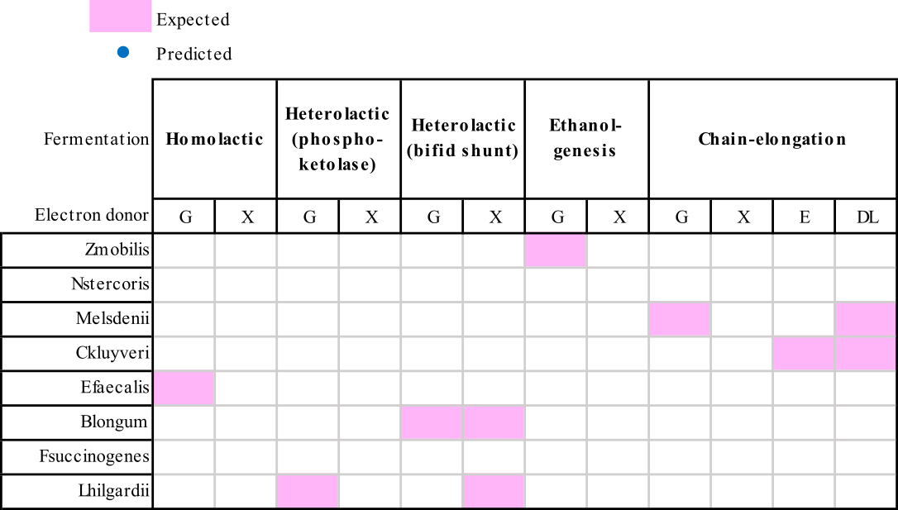
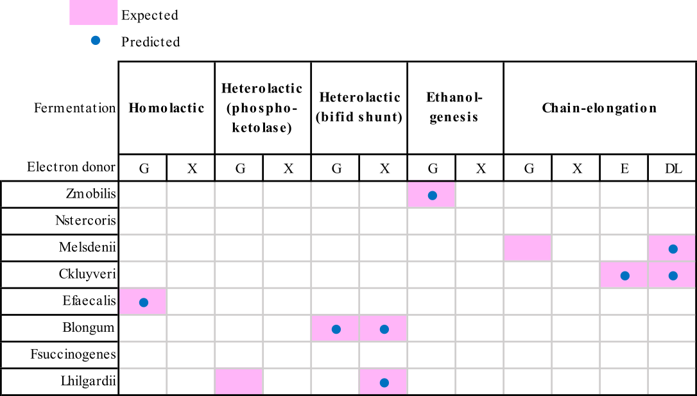
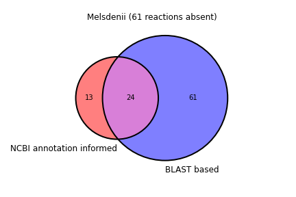

# genomic_potential_analysis

## Purpose:
This repository generates information about the fermentative genomic potentials of user-provided organisms. It infers the presence / absence of proteins, enzymes, and pathways commonly identified in fermentative metabolisms of self-assembled anaerobic microbiomes fed agroindustrial residues. Outputs include Boolean matrices wherein 1's and 0's indicate the presences and absences, respectively, of coding regions for proteins, enzymes, and pathways for every genome queried; comparisons of BLAST based and NCBI annotation informed analyses; and all supporting information.

Directories that are included in this repo were generated using the steps in the Example section.

Code in genomic_potential_analysis has been tested on MacOS (>13.2).

## Inputs:
This must be done making a 'refgenomes' directory in the working directory (`mkdir refgenomes`), and populating the directory with genomic nucleotide files in .fna format. 

This must be done by making an 'NCBI_annotations' subdirectory in the working directory (`mkdir output/NCBI_annotations`), and populating it with GenBank files in .gbff format.

Note: code relies on the base names of files in 'NCBI_annotations' to match exactly with and correspond to base names of files in 'refgenomes'. For example, a bacteria.gbff file should correspond to a bacteria.fna file.

## Usage:
1. You can download the git repository:

        git clone https://gitpub.wei.wisc.edu/aingle/genomic_potential_analysis.git
2. You can run the primary scripts that use files already in the 'codefiles directory:

        python3 Blast_and_assign_function.py
        python3 Annotation_informed_functional_assignments.py
3. Or, first, curate the files in this repo, and reinitiate:

        python3 Rename_uniprot_fastas.py

## Requirements:
- python3
- Python modules and libraries pandas, numpy, pathlib, subprocess, Bio, re, matplotlib, matplotlib-venn

## Example:

This example will serve as a screen of this repository, and the inferences made from it. For this example, we downloaded nucleotide FASTA (.fna) and GenBank (.gbff) files of organisms with characterized substrate-specific metabolisms from NCBI (Table 2, Supplementary_repository_file_1.xlsx), which served as user-provided script inputs.

We first looked at results from running `Blast_and_assign_function.py` alone, then looked at results after proceeding to run `Annotation_informed_functional_assignments.py` 
#### Steps
###### 1. Clone repository:

        git clone https://gitpub.wei.wisc.edu/aingle/genomic_potential_analysis.git
###### 2. In working directory, make `refgenomes` directory and `NCBI_annotations` subdirectory:

        mkdir regenomes
        mkdir output/NCBI_annotations
###### 3. Download nucleotide FASTA (.fna) and GenBank (.gbff) files from NCBI for organisms of interest (Table 2, Supplementary_repository_file_1.xlsx) and move to appropriate directories.
###### 4. Run first primary script from your working directory:

        python3 Blast_and_assign_function.py

This will generate two directories, `databases` where BLAST databases are stored, and `output` where results (four text files: **tBLASTn_summary.txt**, **filtered_tBLASTn_summary.txt**, **protein_encoding_copy_assignments.txt**, and **BLAST_EC_set_operations.txt**; and one subdirectory `BLAST_fermentations`) are stored. You should be notified when the script is done running at the commnand line.

Substrate-specific fermentation pathway potentials are stored in `BLAST_fermentations`.

###### 5. Run second primary script from your working directory:

        python3 Annotation_informed_functional_assignments.py
This will generate three text files (**NCBI_annotation_based_functional_assignment.txt**, **BLAST_EC_set_operations.txt**, and **genomic_potential_reactions.txt**) and two subdirectories (`Venn_diagrams` and `BLAST_annotation_fermentations`) in `output`.

#### Results
###### Fermentative pathways based on BLAST based analysis
The BLAST based analysis (i.e., using only results generated by `Blast_and_assign_function.py`) predicted zero out of ten (0%) possible fermentation pathways by any of the queried genomes, as seen in Supplementary Figure 1, which was constructed by opening and manipulating `BLAST_fermentations` text files with Microsoft Excel.

Supplementary Figure 1: Summary of predicted and exepcted substrate-specific fermentations present in genomes using a BLAST based genomic potential analysis. Genomes are identified by their monikers (Table 2, Supplementary_repository_file_1.xlsx). Abbreviations: D-lactate (DL), Ethanol (E), D-glucose (G), and Xylose (X). Circles indicate pathways predicted by the script. Shaded cells indicate characterized metabolisms expected from a brief literature review (Table 2, Supplementary_repository_file_1.xlsx).

###### Genomic potential based on BLAST based and NCBI annotation informed analyses
The BLAST based and NCBI annotation informed analyses (i.e., using results generated by `Blast_and_assign_function.py` and `Annotation_informed_functional_assignments.py`) predicted eight of the ten (80%) expected fermentation pathways (Supplementary Figure 2). Thus, the analyses generated two false-negative fermentations: Chain-elongation using D-glucose for Melsdenii and Homolactic using D-glucose for Lhilgardi; the missing enzymes for the two cases are 'Glucose-6-phosphate isomerase' and '6-phosphogluconolactonase', respectively (see 'D-glucose_fermentations_missing_reactions.txt'); these correspond to the query proteins 'P0A6T1' and 'P52697' (see 'metabolic_reactions.txt').

Supplementary Figure 2: Summary of predicted and exepcted substrate-specific fermentations present in genomes using a BLAST based genomic potential analysis. Genomes are identified by their monikers (Table 2, Supplementary_repository_file_1.xlsx). Abbreviations: D-lactate (DL), Ethanol (E), D-glucose (G), and Xylose (X). Circles indicate pathways predicted by the script. Shaded cells indicate characterized metabolisms expected from a brief literature review (Table 2, Supplementary_repository_file_1.xlsx).

###### Hits for P0A6T1 against Melsdenii and P52697 against Lhilgardii were filtered out
Parameter cutoffs for BLAST hits consist of the following: e-values < 1*10^(-10); percent identity > 25%; and query coverage > 70%.

Line 1: truncated 'tBLASTn_summary.txt' line for for a 'P0A6T1.faa' against 'Melsdenii.fna' BLAST hit:

        Sequence_ID	        Sequence_start	Sequence_end	Percent_identity	Length	Evalue	        Query_coverage
        NZ_CP027569.1	689908	        688487	        24.665	                523	1.02e-16	89
Line 2: truncated 'tBLASTn_summary.txt' line for a 'P52697.faa' against 'Lhilgardii.fna' BLAST hit:

        Sequence_ID	        Sequence_start	Sequence_end	Percent_identity	Length	Evalue	        Query_coverage
        NZ_CP047121.1	2574660	        2573947	        27.386	                241	4.03e-22	69

'P0A6T1' was filtered out because the percent identiy (24.665%) was less than 25%; 'P52697' was filtered out because the query coverage (69%) was less than 70%.

#### Discussion
###### A BLAST based approach should be extended upon 
The BLAST based analysis predicted more genomic potential than the NCBI informed analysis. This was the case for all queried genomes, such as Melsdenii (Supplementary Figure 3)

Supplementary Figure 3: Venn diagram of enzymes predicted within the genomic potential of Melsdenii using BLAST based and NCBI annotation informed analyses.

However, as an isolate approach, the BLAST based analysis was unable to predict full fermentation pathways (Supplemental Figure 1). Further, the filter step omitted two proteins that corresponded to sole missing enzymes in fermentation pathway predictions (Line 1 and Line 2) - while we cannot reliably diagnose genomic potential false-positives, the intention of the filter step of the BLAST hits is to prevent such. Correcting such omissions to improve predictability requires manual investigation, then decision-making. Thus, approaches that provide more information are necessitated. It is clear that using additional data, e.g., annotations, can improve predictability (Supplemental Figure 2). Alternatively, more extensive approaches, e.g., machine learning algorithms, deserve investigation.

## Methods

Alignments were performed using Basic Local Alignment Search Tool. 

Query proteins FASTA files were downloaded from UnitProtKB with ID mapping tool, and split using SplitFasta.

Protein information was downloaded from UniProtKB with ID mapping tool in TSV format.

Metabolic reactions are an amended, extended set of BiGG Model database reactions in the metabolic model, iFermCell215.

The associations between query proteins, metabolic reactions, and enzyme comission numbers were manually assigned and selected (Table 1, Supplementary_repository_file_1.xlsx).

## Items to be improved:
- Use UniProt API feature to download query proteins
- Compile scripts into a single program that take in arguements at command line

